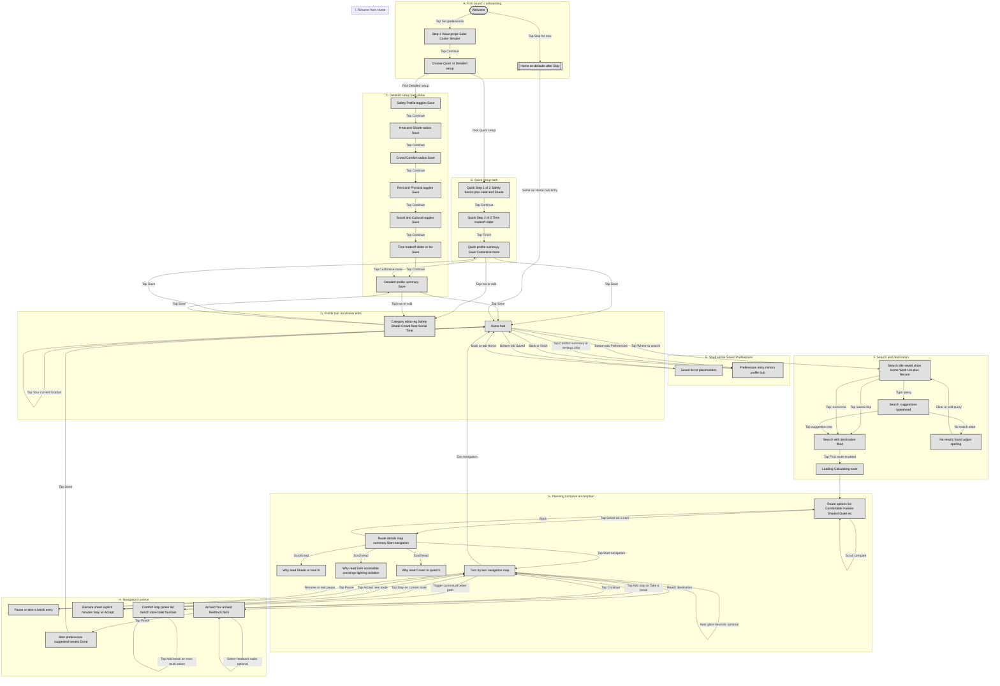
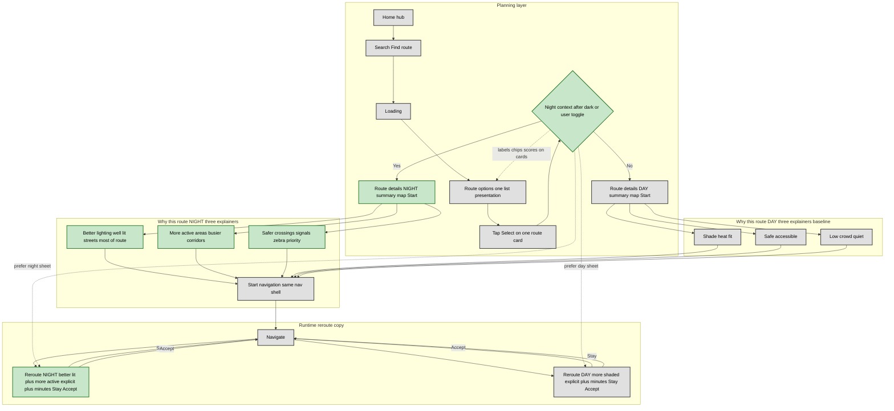
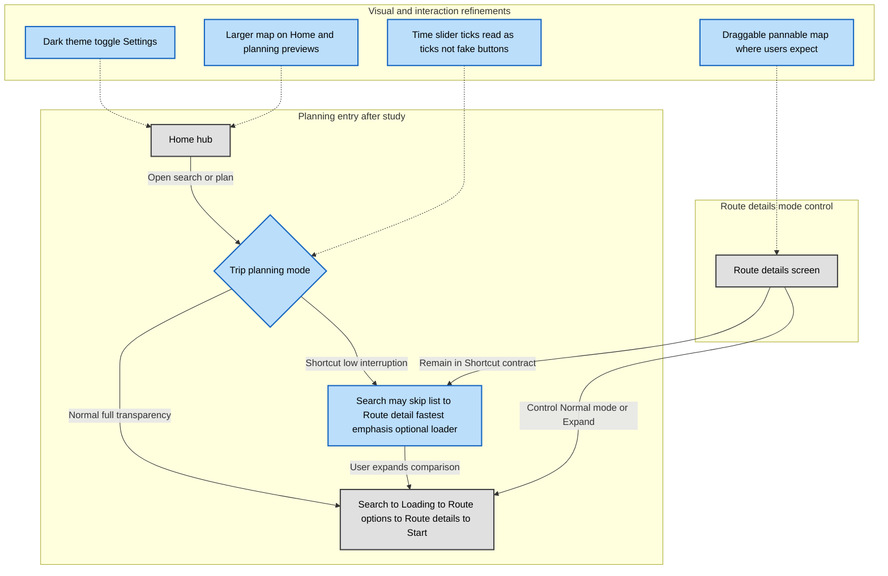
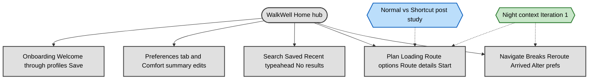

# WalkWell: Original sketches vs Iteration 1 vs post–user study — full interaction map

This README supports **SIT216 Assessment 2**. It does three things:

1. **Critical timeline (matches your correction):** **Iteration 1** is **night / diurnal context** in **copy, scoring labels, and “Why this route?”** — *not* **Normal vs Shortcut**. **Normal vs Shortcut** + **mode control on route details** + **visual/affordance/map interaction** polish sit in **post–usability study** (blue).
2. **Full baseline:** **Every screen** in the paper → hi-fi spine is named; **every transition** is an **arrow label** (tap / type / save / continue / accept / stay / …).
3. **Mermaid:** Colour classes — **grey** = original corpus, **green** = Iteration 1 (night intelligence), **blue** = after user testing (planning mode + UI polish).

---

## 1. Colour legend (`classDef`)

| Class   | Meaning |
|---------|---------|
| `paper` | **Baseline** (hand-drawn + same-architecture hi-fi): onboarding, profiles, search, routes, nav, breaks, reroute, feedback, alter prefs. |
| `iter1` | **Iteration 1:** **night context** on **route options**, **route details / “Why this route?”** (lighting · activity · crossings), **in-nav reroute** tuned for night (*better-lit, more active*). |
| `post`  | **Post–user study:** **Normal vs Shortcut** planning contract, **expand/return to full comparison** from route details, **dark theme**, **larger map**, **slider affordance**, **draggable map**. |

**Night “Why this route?” (readable wording):** the night screen explains **three separate dimensions** — **better lighting** (well-lit corridors), **more active areas** (busier streets / natural surveillance), **safer crossings** (signals / pedestrian priority). It does **not** mush them into one meaningless slug.

---

## 2. Chart A — **Complete baseline journey** (all screens, all interactions)

*Grey only. Read arrow labels as the **minimum** interaction set you can demo.*



### Baseline checklist (for figures / video)

| # | Screen / state | Outgoing interactions (labels) |
|---|----------------|--------------------------------|
| A | Welcome | Skip → Home defaults; Set preferences → Step 1 |
| B | Step 1 | Continue → Choose setup |
| C | Choose setup | Quick → Quick 1; Detailed → Safety |
| D | Quick 1 / 2 | Continue / Finish → Quick profile |
| E | Detailed 1…6 | Continue chain → Detailed profile |
| F | Quick / Detailed profile | Save → Home; row tap → Category editor; Quick → Customise more → Detailed |
| G | Home | Tabs Saved / Preferences; tap search; tap comfort summary; location |
| H | Search | Chips / recent / typeahead / Find route / no results |
| I | Loading | → Route options |
| J | Route options | Select → Route details; scroll compare |
| K | Route details | Back; scroll Why; Start navigation |
| L | Navigate | Pause resume Add stop reroute Stay Accept auto glare optional End navigation Arrival |
| M | Break picker | Multi select; Continue |
| N | Arrived | Feedback radios; Finish |
| O | Alter preferences | Done → Home |
| P | Pause | Pause sheet; resume → Navigate |
| Q | End navigation | Exit → Home if prototype allows |

**Explicit feedback radios (baseline / day framing):** *Too hot*, *Too crowded / too busy*, *Felt unsafe*, *Confusing directions* (if present), *Good*. **Night framing** may replace *Too hot* with a lighting-relevant option if that matches your final UI.

---

## 3. Chart B — **Iteration 1 only** (night context: options, why, reroute)

*Green = **added or reframed for after-dark**. Grey = same shell as baseline. **No** Shortcut / Normal here.*

**Intent:** Baseline **already** routes; Iteration 1 **re-weights explanation** so **lighting**, **street activity**, and **crossings** lead at night; **shade / crowd** copy is still in the model but **not the headline** when sun load is irrelevant.



**Report honesty:** Baseline already had **reroute + Stay / Accept**. Iteration 1 adds the **night-appropriate promise** (*better-lit and more active*) and **Night Comfort** framing — not “we invented rerouting.”

---

## 4. Chart C — **Post–user study** (Normal vs Shortcut + UI polish)

*Blue = introduced **after** usability testing per your brief. Dashed = overlays same nodes as baseline.*



---

## 5. Optional — **Mentor-style** hub (one page figure)

*Colours: **green** only on night fork node `NC`; **blue** on `TM` if you want one slide that shows both eras.*



---

## 6. Figures / annotations (Figma / report)

| Figure | Composite | Callouts |
|--------|-----------|----------|
| **F-baseline-strip** | Welcome → Choose setup → one profile → Home | Numbered **①–③** on **Save / Continue / Skip** only |
| **F-night-options** | Route options **day vs night** same destination | **①** Night Comfort % **②** Lighting / Activity / Crossings chips **③** Day shade lead for contrast |
| **F-night-why-three** | One route details night with **three** Why rows | **①** Better lighting **②** More active areas **③** Safer crossings — **separate** callout each |
| **F-night-reroute** | Bottom sheet night vs day | **①** +minutes **②** Stay **③** Accept |
| **F-post-mode** | **Normal** vs **Shortcut** from Home/search | **①** Mode picker **②** Skip list **③** Expand to full comparison |
| **F-post-polish** | Light vs dark; small vs large map | **①** Dark theme **②** Map scale **③** Drag |

---

## 7. Pasteable report paragraph (timeline corrected)

*The hand-drawn flows already defined the **closed-loop comfort walk**: profiles, search, multi-route comparison, transparency (“why”), navigation, optional comfort stops, explicit reroute trade-offs, arrival feedback, and preference adjustment. **Iteration 1** preserves that architecture but adds **diurnal context** so that, **after dark**, route presentation and explanations foreground **lighting**, **street activity**, and **safe crossings** rather than **shade-first** framing. **Usability testing** then motivated **Normal vs Shortcut** as two **planning contracts**, clearer **return to full comparison**, and **presentation fixes**: **dark UI**, **larger maps**, **honest slider affordances**, and **draggable maps**.*

---

## 8. Rendering Mermaid (GitHub-safe)

- One ```mermaid block = one diagram starting with `flowchart` or `graph`.
- In `class A,B,C stylename` always use **commas** between IDs.
- If GitHub fails on complex graphs, paste into [mermaid.live](https://mermaid.live) and export **PNG**.

---

*End. Keep **green** claims aligned with **night context** only; keep **blue** aligned with **post-study** mode + polish.*
