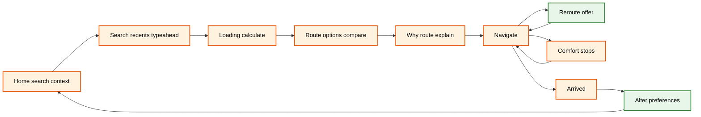
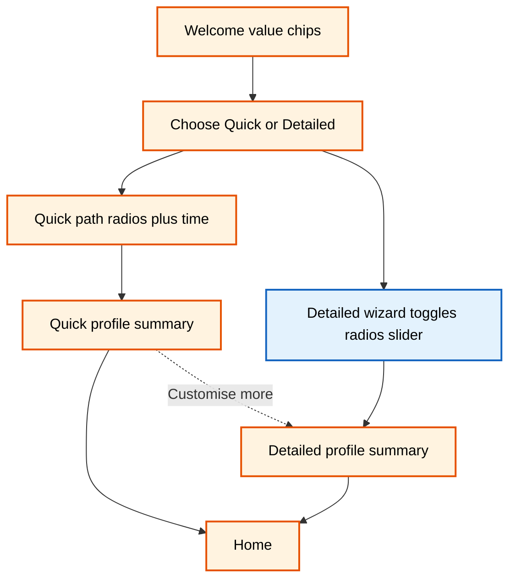

# WalkWell — **Low-fi prototype (PDF) vs hi-fi screens**: iteration report

**Sources**

- **Low-fi (baseline):** `c:\Users\asusn\Downloads\WalkWell Prototype.pdf` — **7 pages** of hand-drawn **user flows + marginal research rationale** (comfort vs efficiency, cognitive load, safety %, heat as pain point, crowd spectrum, feedback loop, etc.).
- **Hi-fi (Iteration 1):** composite exports (see **§0.2**). These are **production-style** WalkWell frames: onboarding, **two variants of detailed setup** (see §4.3), home → search → routes → navigation → breaks → post-trip.

**How to read this document**

- **§1–7** map **PDF page themes → concrete hi-fi surfaces** and list **deltas** point-by-point.
- **Diagrams** use **colour classes:** **tan = low-fi / sketch intent**, **green = hi-fi implemented**, **blue = intentional change or new capability** (not “random polish”).
- **Annotations** are **numbered figure callouts** (① ② ③ …). Prefer **one composite figure + 3–6 callouts** per topic; avoid duplicating the same idea in a table.

---

## 0.2 Hi-fi image assets (paste into report as figures)

| # | File (full path) | What it shows |
|---|------------------|----------------|
| F1 | `C:\Users\asusn\.cursor\projects\c-Users-asusn-Documents\assets\c__Users_asusn_AppData_Roaming_Cursor_User_workspaceStorage_8233c5d5eab9afe657929928156f1fa1_images_image-7f46534a-fe1f-4b03-9638-2095ea351e40.png` | **Onboarding + home + profiles + quick + detailed safety** strip |
| F2 | `C:\Users\asusn\.cursor\projects\c-Users-asusn-Documents\assets\c__Users_asusn_AppData_Roaming_Cursor_User_workspaceStorage_8233c5d5eab9afe657929928156f1fa1_images_image-a25d3d53-e5e7-4bd2-ae0c-88086215e424.png` | **Ten screens: two rows** — “Save per category” iteration vs **six-step stepper + Safety Profile** |
| F3 | `C:\Users\asusn\.cursor\projects\c-Users-asusn-Documents\assets\c__Users_asusn_AppData_Roaming_Cursor_User_workspaceStorage_8233c5d5eab9afe657929928156f1fa1_images_image-1df20229-a44b-413b-9f6f-a3523866b4cf.png` | **Time / Finish**, **home**, **search**, **loading**, **route options**, **route details / Why** |
| F4 | `C:\Users\asusn\.cursor\projects\c-Users-asusn-Documents\assets\c__Users_asusn_AppData_Roaming_Cursor_User_workspaceStorage_8233c5d5eab9afe657929928156f1fa1_images_image-705f0d9d-952d-4ca1-9962-8f5ac8455d9f.png` | **Navigate**, **shaded reroute**, **take a break**, **arrived**, **alter prefs** |

---

## 0.3 Master legend — colour coding in Mermaid (paste `classDef` with each chart)

```text
classDef lowfi fill:#FFF3E0,stroke:#E65100,stroke-width:2px,color:#000
classDef hifi fill:#E8F5E9,stroke:#2E7D32,stroke-width:2px,color:#000
classDef delta fill:#E3F2FD,stroke:#1565C0,stroke-width:2px,color:#000
```

- **lowfi** — behaviour or structure **stated in the PDF** (or clearly implied by sketch annotations).
- **hifi** — **visible in hi-fi** composites.
- **delta** — **material change** (new step, new control type, new chrome, copy/system behaviour).

---

# 1. PDF page ≈ theme 1 — **Active route, reroute, environmental response**

**Low-fi intent (PDF p.1 excerpts):** route selection leads to **high-contrast** active route; **contextual “more comfortable path”** with **explicit +3 min** trade-off; **Stay** vs **Take**; optional **auto brightness** for glare; **shade prioritised** after accept; **non-intrusive** switching; **comfort-relevant landmarks**.

**Hi-fi (F4):** map-led navigation, **+ Add stop**, bottom instruction card; **“A more shaded route is available”** with **+3 min** and **+38% Shade**; **Accept** / stay path; top/banner **“Taking shaded route…”** after acceptance.

### 1.1 Feature-by-feature

| Aspect | Low-fi (PDF) | Hi-fi | Δ |
|--------|----------------|-------|---|
| **Reroute trigger** | Environmental improvement along nearby paths (annotation). | **Shade**-led suggestion card on map. | **Same story, hi-fi specifies dimension** (shade %) |
| **Trade-off honesty** | Explicit minutes (+3 min). | Same pattern + **percent shade delta**. | **More legible consequence** |
| **User agency** | Non-intrusive; user choice. | Primary **accept** + secondary **stay/dismiss** pattern. | **Aligned** |
| **Post-change feedback** | “route updated, shade prioritised.” | **Banner** confirming **shaded** route + time cost. | **Stronger confirmation** |
| **Brightness** | Auto-adjust for outdoor visibility (annotation). | **Not evidenced** in described hi-fi strip. | **Gap or later iteration** — state honestly in report |
| **Landmarks** | Highlight comfort-relevant landmarks. | Turn card references **Central Park** style landmark in described frames. | **Partial** |

**Figure annotation — use F4, callouts:**  
① **Explicit minute cost** on suggestion (principle: *error prevention / informed consent*).  
② **Percent shade gain** (principle: *visibility of system status*).  
③ **Persistent banner** after accept (principle: *feedback*).  
④ (If discussing PDF honesty) **note gap** if auto-brightness not in hi-fi.

---

# 2. PDF theme 2 — **Comfort stops, arrival, feedback, alter preferences**

**Low-fi (PDF p.2):** context-aware **comfort spots**; **pause / resume**; optional **user-reported comfort**; **Finish → Alter preferences**; suggested tweaks **based on route change decisions**; **Save** loops back toward home.

**Hi-fi (F4):** **Take a break** list with **Add Break**, **Selected** state, **Route change** timeline with ETAs; **You arrived** + radios (**Too hot**, **Too crowded**, **Felt unsafe**, **Good**); **Alter preferences** with **Sun exposure** + **Crowd levels** sliders.

### 2.1 Feature-by-feature

| Aspect | Low-fi (PDF) | Hi-fi | Δ |
|--------|----------------|-------|---|
| **Stops** | Suggested spots; resume. | Rich list: **distance, +time, tags** (shaded/indoor/water); **route impact** panel. | **Higher transparency** on trip impact |
| **Feedback** | Optional comfort capture. | Structured **multi-option** feedback. | **More standardisable data** |
| **Alter prefs** | Suggestions tied to route decisions. | **Sun** + **crowd** sliders (global). | **Simpler surface** than full profile; **night report** should discuss **crowd vs activity** wording at route level |
| **Terminology** | Generic “comfort.” | **Too crowded** on feedback while you promote **activity** on night routes | **Flag for copy coherence** across day/night |

**Figure annotation — F4:**  
① **Route change** bullets (ETAs) — *predictability*.  
② **Multi-select** stops + **Continue** — *user control*.  
③ **Feedback → Alter prefs** bridge — *closed loop* (PDF’s iterative decision-making).  

---

# 3. PDF theme 3 — **Welcome, skip, home defaults, setup choice (Quick vs Detailed)**

**Low-fi (PDF p.3):** **Skip** = fast entry, avoids drop-off; **default settings** now; **trust** pre-input; **Continue** → **choose setup**; **user control over effort**; **more vs less customisable** branches; **preference widget** from home.

**Hi-fi (F1):** **Welcome** with **value subtitle + chips**; **Set preferences** vs **Skip**; **Quick (~30 s)** vs **Detailed (2–3 min)** cards; **Home** shows **defaults banner**, **comfort chips**, **bottom nav**.

### 3.1 Feature-by-feature

| Aspect | Low-fi (PDF) | Hi-fi | Δ |
|--------|----------------|-------|---|
| **Skip / friction** | Skippable; immediate access. | **Skip for now** secondary. | **Aligned** |
| **Defaults visibility** | Encourage later personalisation. | **“Using default settings…”** line on Home. | **Stronger system status** |
| **Trust** | Builds trust *before* heavy input. | Subtitle explains **why** prefs matter. | **Explicit help/docs** moved on-screen |
| **Setup choice** | Two effort levels. | Two cards + **time badges**. | **Expectation management** |
| **Global IA** | Preference widget on home. | **Home / Saved / Preferences** tabs. | **Institutionalised wayfinding** |

**Figure annotation — F1:**  
① **Primary vs secondary CTA** on Welcome.  
② **Comfort chips** + **settings icon** (dual coding).  
③ **Bottom nav** vs single-screen widget in sketch.  
④ **Quick vs Detailed** honest time badges.

---

# 4. PDF theme 4 — **Comfort dimensions (safety, heat, crowd spectrum, rest, social, time) + profile**

**Low-fi (PDF p.4 — dense research notes):** Safety **high priority (~29.3%)**; heat **top pain**; crowd **slider** (dislike crowding **and** emptiness); rest toggles (**manageable not just possible**); social comfort (**identity-based risk**); time trade-off (**deviation from shortest path**); profile **save returns** without replaying wizard; **features chosen by users**.

**Hi-fi:** See **F1** (safety toggles, quick radios), **F2** (full detailed sequence — **two versions**), **F3** (time slider + Finish).

### 4.1 Safety

| Aspect | Low-fi | Hi-fi (F1 detailed safety) | Δ |
|--------|--------|---------------------------|---|
| **Count / granularity** | 3 toggles in sketch corpus. | **4 toggles** incl. **safer crossings**. | **Expanded** — matches **“why route”** crossings talk |
| **Night language** | “low light” notions in research. | **“good lighting at night”** in copy. | **Direct night alignment** |

**Annotations:** ① fourth toggle crossings; ② night lighting subtext.

### 4.2 Heat & shade

| Aspect | Low-fi | Hi-fi | Δ |
|--------|--------|-------|---|
| **Options** | Low / balanced / max (sketch corpus). | **Four radios** + **No shade**. | **Explicit “ignore shade”** |

**Annotations:** ① **No shade** option; ② default **Balanced** selected.

### 4.3 **Critical — Crowd: spectrum vs buckets**

| Aspect | Low-fi (PDF p.4) | Hi-fi (F2) | Δ |
|--------|------------------|------------|---|
| **Control type** | **Slider** captures spectrum; avoids binary buckets. | **Four radios** (Deserted → Noisy). | **Representation change** — middle-ground via **labels**, not continuous thumb |
| **Research trace** | “dislike heavy crowding **and** emptiness.” | Same idea **expressed as endpoints**; **Deserted** is a strong label. | Report must say whether this is **simplification for tap targets** or **drift from research fidelity** |

**Annotations (F2 Crowd screen):** ① **question still says crowded** while night routes may use **activity** elsewhere — **terminology coherence**; ② **selected** tier vs slider mid-point in PDF.

### 4.4 Rest & physical; social & cultural

| Aspect | Low-fi | Hi-fi | Δ |
|--------|--------|-------|---|
| **Rest** | Independent toggles; suitability penalty if off. | Same pattern; **generic repeated helper text** in mock. | **Copy QA** |
| **Social** | Shopping / community / familiar / active streets. | **24/7 store** etc.; **wrong subtitle** reused from Rest in some frames. | **Content bug** + semantic shift toward **night amenity** |

**Annotations:** ① **subtitle error**; ② **24/7 store** vs “shopping” in sketch.

### 4.5 Time trade-off

| Aspect | Low-fi | Hi-fi | Δ |
|--------|--------|-------|---|
| **Range** | +5 / +10 / +15 style (sketch corpus). | **0–50** slider + **minute chips**. | **Broader willingness**; **affordance risk** on chips |

**Annotations (F3 time):** ① **Finish** terminates wizard; ② **chips** vs continuous drag.

### 4.6 **Structural evolution inside hi-fi (F2 top vs bottom row)**

**This is internal hi-fi iteration but overlaps PDF ideas:**

| Row | Structure | PDF alignment |
|-----|-----------|---------------|
| **Top (F2)** | Per-category **Save**, **no stepper** in description | Like **non-linear “adjust one dimension”** pages — closer to **profile edit** pattern |
| **Bottom (F2)** | **Six-step stepper**, **Continue**, **Safety Profile** first | Closer to **guided onboarding** in teaching materials — **stronger linear scaffold** |

**Report sentence:** *The PDF argues for **low cognitive load** and **non-linear return** after summary; the hi-fi **still supports** profile edit loops (F1 profiles) but **also** ships a **stepper-based** detailed wizard — combining **guidance** with **escape hatches**.*

---

# 5. PDF theme 5 — **Quick-setup grouping (high-priority factors + focused time screen)**

**Low-fi (PDF p.5):** group **highest priority** comfort in **one step** to reduce screens; **checkbox quick multiselect**; **separate** screen for **time trade-off** (“route flexibility”); quick profile shows **only configured** prefs.

**Hi-fi (F1):** **Quick** uses **two-step** pattern (safety **radios**, shade **radios**) + **time slider**; **Quick profile** shorter list; **Customise more**.

### Feature deltas

| Aspect | Low-fi | Hi-fi | Δ |
|--------|--------|-------|---|
| **Safety / shade input** | Checkboxes (multi). | **Single-select radios** per group in shown quick flow | **Mutually exclusive clusters** vs sketch “multiselect” |
| **Time** | Dedicated screen emphasised. | Dedicated **slider** screen — **aligned** |
| **Summary** | Only configured prefs. | **Three lines + customise** | **Aligned intent** |

**Annotations (F1 quick):** ① **radio** vs PDF **checkbox** mental model; ② **2-step progress** chrome.

---

# 6. PDF theme 6 — **Home hub “Quick setup?” diamond + two profile hubs**

**Low-fi (PDF p.6):** diamond **Quick vs Detailed**; **feature summary**; **edit** to related screen; **save** returns; **expand** quick → detailed; both **save → home**.

**Hi-fi (F1):** **Visual** quick vs detailed choice on **Welcome path** + **profile** summaries; **Customise more** expands breadth.

**Annotations:** ① **two summaries** (quick vs detailed list density); ② **explicit expand** affordance.

---

# 7. PDF theme 7 — **Search → compare routes → why → load → navigate**

**Low-fi (PDF p.7):** search primary; **weather/context** for comfort; **familiarity** (recents); **dynamic filter**; **no dead ends**; **comfort vs efficiency** comparison; **weighted model**; **why** transparency; can **return** to route list; **Find Route** / suggestion triggers load.

**Hi-fi (F3):** **Where to?**; saved + recent; typing + **suggestion meta** (“22 min • mostly shaded”); **no results** state; **CALCULATING** loader; **route cards** with comfort % and trade-off; **Why this route** rows (well-lit + crossings, shade, **low crowd**).

### 7.1 Feature-by-feature

| Aspect | Low-fi | Hi-fi | Δ |
|--------|--------|-------|---|
| **Search affordance** | Primary interaction. | Large field + **disabled Find** until valid — **error prevention** |
| **Context strip** | Real-time comfort decisions. | **Feels like / UV / Clear** on Home |
| **Suggestions** | Dynamic filter. | Typeahead + metadata |
| **Empty state** | Prevent dead end. | **No results** copy |
| **Comparison** | Comfort vs efficiency. | **Comfortable vs fastest vs shaded** (+ more) |
| **Explainability** | Links to profile. | **Why** list with **High/Low** tags |
| **Night framing** | Not explicit in PDF text extract. | Your Iteration 1 **night frames** (elsewhere) swap **shade/crowd lead** for **lighting/activity** — **pair figures** when claiming |

**Annotations (F3):** ① **trade-off minutes** on recommended card; ② **Why** trio; ③ **suggestion subtitle** feeds forward outcome.

---

# 8. Diagrams — paste into appendix or inline

## 8.1 **Trip spine** (PDF p.7 + F3 + F4)



**Note:** adjust `class` if you treat reroute/feedback as already in PDF — here **X** and **F** are emphasised as **richer hi-fi surfaces** (percent shade, structured alter).

## 8.2 **Onboarding / setup** (PDF p.3–6 + F1 + F2)



**Rationale for `delta` on `DS`:** stepper + **fourth** safety control + **crowd radios** + **no shade** + **0–50** time — **material evolution** from PDF’s **sketch-level** spec.

---

# 9. **One summary matrix** (use once at end — not per section)

| Theme (PDF) | Hi-fi where it shows | Main delta | Evidence figure |
|-------------|----------------------|------------|-----------------|
| Environmental reroute + minutes | Nav suggestion + banner | +shade %, clearer confirmation | F4 |
| Stops + feedback loop | Break list + arrived + alter | ETA timeline, structured feedback | F4 |
| Skip + defaults + trust | Welcome + Home banner | stronger system status + IA | F1 |
| Six comfort dimensions | Detailed + profiles | crowd **control type**; crossings; no shade; time range | F2, F1 |
| Quick grouping | Quick 2-step + slider | radios vs PDF checkbox idiom | F1 |
| Search + compare + why | Search + routes | rich cards + why rows | F3 |

---

# 10. What to write in **your own words** (2–3 sentences)

*The PDF prototype encoded **research rationales** in the margins (safety weighting, heat pain, crowd spectrum, non-linear profile saves). The hi-fi **makes those ideas operable** through **standard components**, **clearer system status**, and **richer route and navigation feedback**, while introducing **specific representation shifts**—notably **crowd buckets vs slider** and **quick-flow radios vs checkbox mental models**—that should be defended as **design simplification** or revised toward the **original research fidelity**. Pair **day and night** route figures when claiming **activity-forward** language so terminology stays consistent with **preference and feedback** screens.*

---

# 11. Honesty checklist (submission hygiene)

- [ ] **Auto-brightness** (PDF p.1) — present in hi-fi? If not, say **not implemented** or **out of scope**.
- [ ] **Crowd vs activity** — night route copy vs **Crowd** chips / **“Too crowded”** feedback — align or document **exception**.
- [ ] **F2 top vs bottom** — clarify whether both are **submission canon** or **process artifacts**.
- [ ] **Duplicate / wrong copy** — Social subtitle, Rest boilerplate — **QA** or acknowledge.

---

*Generated for: WalkWell SIT-style comparison. Low-fi text derived from PDF text extraction; hi-fi from provided composites and frame descriptions.*
