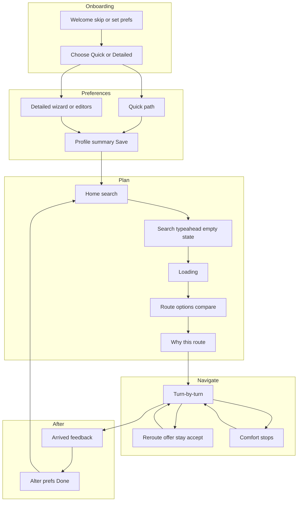
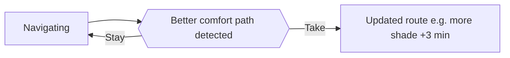

# WalkWell — **Low-fi prototype (PDF) vs hi-fi screens**: full comparison report

**Purpose:** Document **what changed** from the **seven-page annotated low-fi** (`WalkWell Prototype.pdf`, *Downloads*) to the **current hi-fi** mobile screens (your exported image sets), **why** those changes support usability and Iteration 1 goals, and **exactly** what to annotate on figures for assessment.

**Sources**

| Source | Role |
|--------|------|
| **Low-fi** | `c:\Users\asusn\Downloads\WalkWell Prototype.pdf` — **7 pages** of **hand-drawn flow fragments + margin annotations** (routing, onboarding, preferences, search, post-trip). Text extraction preserves wording; spacing reflects PDF encoding. |
| **Hi-fi** | Composite exports including: setup/home strips, **detailed setup** (wizard + category editors), **search → loading → route options → route details**, **navigation → breaks → reroute → arrival → alter prefs**. Asset examples: `...\assets\...image-7f46534a....png`, `...image-a25d3d53....png`, `...image-1df20229....png`, `...image-705f0d9d....png`. |

**How to read this report:** Use **numbered figure callouts ①–⑤** in exports; use **tables** for scanability; use **Mermaid** in Word/GitHub via [mermaid.live](https://mermaid.live) → PNG if needed.

---

## 1. Executive summary

The **PDF low-fi** already specified a **closed-loop comfort walk**: **skip-friendly onboarding**, **quick vs detailed** preference capture, **spectrum-based crowd** thinking, **separate time-trade-off** thinking, **profile summary + per-category edit without replaying the wizard**, **search with familiarity and empty-state recovery**, **comfort-weighted route comparison**, **“why this route” transparency**, **active navigation** with **environment-triggered reroute** (+ explicit minutes, **stay / take**), **optional comfort stops**, and **post-arrival feedback** feeding **preference adjustment**.  

The **hi-fi** **preserves that architecture** and **materialises** it as a **product**: **WalkWell** branding, **typed components**, **stepped detailed setup** with a **six-icon progress bar**, **quick two-step path** with optional **Save / Continue / Finish** variants, **readable defaults** on **Home** (banner + **Comfort Preferences** chips), **bottom navigation** (**Home / Saved / Preferences**), **typeahead search** with **saved + recent**, **loading state**, **multi-card route options** with **comfort %** and **trade-off minutes**, **route details** with **“Why this route?”** rows, **turn-by-turn** nav with **+ Add stop**, **detour picker** with **ETA breakdown**, **proactive reroute sheet** (e.g. **more shaded** + minutes), **arrival feedback**, and **alter preferences** with **sliders**.  

**Iteration 1–relevant deltas** (from your project framing):  

1. **Night / safety language** is **embedded in preferences** (e.g. **“good lighting at night”** on the safety toggle) and can be **extended on route screens** with **lighting / activity / crossings**-led “why” copy (your **day vs night** frames).  
2. **Terminology tension:** profile and route UI still say **“Crowd”** in places while **safety** copy uses **“people nearby”** / busier streets — your **activity** vocabulary should land **consistently** on **night** and **“why route”** surfaces.  
3. **Known hi-fi content/affordance gaps** vs aspirations: **placeholder** subtitle on **Social & Cultural**; **minute “chips”** on time slider can read as **separate buttons**; some labels **“SAFETY PROFILE”** on search crops are **artifact**, not user-facing IA.

---

## 2. What the **PDF** contains (page-by-page map)

Use this to **cite low-fi evidence** in-text (*Page n*).

| PDF page | Topics (extracted intent) | Hi-fi chapter it maps to |
|----------|---------------------------|---------------------------|
| **1** | **Route selection → navigate**; **environmental improvement** along path; **non-intrusive** offer; **explicit trade-off** (e.g. **+3 min**); **stay** vs **take** new route; **shade prioritised** feedback; **auto brightness** for glare; **comfort-relevant landmarks**; **high-contrast** route; **end navigation**. | **In-navigation** + **reroute** |
| **2** | **Comfort spots** suggested; **resume** nav; **dropdown** instructions; **arrival → feedback** (**optional**); **finish → alter preferences** suggested from **route change decisions**; **save** if altered; **continue → home**. | **Comfort stops** + **post-trip** |
| **3** | **Skippable** onboarding (**fast entry**, **drop-off** prevention); **defaults** + **later personalisation**; **trust** before heavy input; **continue → choose** quick vs detailed; **effort control**, **cognitive load**; **preference widget** from **home**. | **Welcome** + **choose setup** + **Home** |
| **4** | **Safety** high priority (**~29.3%** theme); **heat** as top pain → **sun exposure** control; **crowd**: users dislike **both** heavy crowding **and** emptiness → **spectrum** (not only buckets); **rest** makes walking **manageable**; **social/cultural** comfort + **identity-based** risk; **routes lacking** selected features → **lower suitability**; **toggles** independent; **sliders** reduce load; **save** returns to **profile** without replaying all steps. | **Detailed / profile** model |
| **5** | **Group** high-priority factors; **fewer screens**; **checkbox-style** quick multiselect; **separate** screen for **route flexibility** / time trade-off (**cognitive load**); quick profile shows **only configured** prefs; **editable**. | **Quick path** + **time** step |
| **6** | **Home** hub: **Quick setup?** diamond; **quick** profile shows configured prefs only; **customise more → detailed**; **save → home**; **edit** drills into **related** screen; **detailed** summary of **all** features; same **save → profile** loop. | **Home** + **profile hub** |
| **7** | **Comfort vs efficiency** comparison; **weighted comfort** ranking; **Find Route** + **suggestion**; **loading**; **familiarity** navigation; **dynamic filter**; **no dead-end**; **why route** transparency linked to **profile**; can **return** to routes; **simple layout**. | **Search → routes → why** |

---

## 3. **Figure plan** (what to export + **exact annotations**)

Build **one composite per row**; limit to **five callouts** per figure in the caption; put overflow detail in body text.

### Figure F1 — **Onboarding & home shell** (low-fi p.3, p.6, p.7 → hi-fi top strip)

| Callout | Low-fi (PDF) | Hi-fi | One-line annotation |
|--------|----------------|-------|---------------------|
| **①** | **Skip** + **defaults** + **widget → setup** | Welcome **Skip for now** + Home **defaults banner** + prefs entry | **Friction reduction** + visible **system state** |
| **②** | **Trust before input** / value preamble | Welcome **subtitle** + **Safety / Shade / Simpler** chips | **Feedforward** before commitment |
| **③** | **Quick vs detailed** effort choice | **Choose setup** cards with **~30 s** / **2–3 min** | **Expectation management** |
| **④** | **Home** as planning hub | **WalkWell** brand, **location**, **Where to?**, **weather**, **Comfort Preferences** chips, **map**, **bottom nav** | **Recognition** + **IA** |
| **⑤** | (p.7) **simple layout** | Polished **type**, **spacing**, **components** | **Aesthetic–usability** + readability |

### Figure F2 — **Preference model: quick vs detailed** (low-fi p.4–6 → hi-fi quick + detailed strips)

| Callout | Low-fi | Hi-fi | Annotation |
|--------|--------|-------|------------|
| **①** | **Safety first** + **29.3%** rationale | Detailed **Safety** toggles incl. **lighting at night**, **people nearby**, **crossings** | **Same construct**, **explicit crossings** + **night-ready** copy |
| **②** | **Heat** top pain | **Heat & Shade** radios incl. **No shade** | **Finer control** + optional **ignore shade** |
| **③** | **Crowd spectrum** (avoid both extremes) | **Crowd Comfort** as **radio bins** | **UI representation shift** (spectrum → discrete) |
| **④** | **Separate time / route flexibility** | Detailed **Time** step **0–50** + quick time **slider**; wizard **Finish** | **Dedicated cognitive step** preserved; **range widened** |
| **⑤** | **Profile summary** + **edit saves back** | Detailed / Quick **profile** rows + **Save** + **Customise more** | **Non-linear** tuning |

### Figure F3 — **Detailed wizard chrome** (hi-fi only — PDF implied steps not drawn as six-icon stepper)

| Callout | Low-fi | Hi-fi | Annotation |
|--------|--------|-------|------------|
| **①** | Step progress **described**, not standardised | **Six-icon** stepper (**Safety → Time**) | **Visibility of progress** |
| **②** | Per-category **full** flow | **Continue** chain + **category editors** with **Save** (top row) | **Two access patterns**: wizard vs direct edit |
| **③** | **Social** as contextual comfort | **Social & Cultural** toggles; **subtitle bug** | **Flag QA** (wrong reused heading) |
| **④** | **Rest** manageability | **Rest & Physical** toggles; watch **duplicate** “crossings” vs **Safety** | **IA consistency** check |
| **⑤** | N/A | **Time** slider **ticks** | **Affordance** risk (**post-test** polish) |

### Figure F4 — **Search → plan → explain** (low-fi p.7 → hi-fi search row)

| Callout | Low-fi | Hi-fi | Annotation |
|--------|--------|-------|------------|
| **①** | **Primary interaction** search | **Where to?** + **saved** + **recent** | **Recognition** over free recall |
| **②** | **Dynamic filtering** | Typeahead **“N” → Nor…** + suggestion meta | **Efficiency** |
| **③** | **No dead-end** | **No results** state | **Error recovery** |
| **④** | **Loading** | **CALCULATING your route** | **System status** |
| **⑤** | **Comfort vs efficiency** | **Route cards** + **% Comfort** + **trade-off** + tags | **Weighted model** made **visible** |

### Figure F5 — **“Why this route?”** (low-fi p.7 transparency → hi-fi route details)

| Callout | Low-fi | Hi-fi (day frame) | Annotation |
|--------|--------|-------------------|------------|
| **①** | **Links to profile** | Row **Safe and accessible** (lighting + crossings) | **Traceability** pref → explanation |
| **②** | **Shade / sun** | **Shaded routes** row | **Environmental** fit |
| **③** | **Crowd** construct | **Low crowd areas** | Rename to **activity** on **night** variant per your spec |
| **④** | **Return to routes** | (Implied **back** in prototype) | **Comparability** |
| **⑤** | **Confirm selection** | **Start navigation** | **Commit** action |

### Figure F6 — **In-navigation & reroute** (low-fi p.1 → hi-fi nav + sheet)

| Callout | Low-fi | Hi-fi | Annotation |
|--------|--------|-------|------------|
| **①** | **Comfort path detected** | **A more shaded route is available** + **Time +x** + **Shade +%** | **Explicit trade-off** |
| **②** | **Non-intrusive** | **Accept** vs **Stay** (secondary) | **User control** |
| **③** | **Route updated** / shade prioritised | Banner **Taking shaded route… +3 min** | **Persistent state** feedback |
| **④** | **Landmarks** | Turn card **Central Park** etc. | **Orientation** |
| **⑤** | **Glare / auto brightness** (low-fi) | *(If not in hi-fi frame set)* — note **gap** or **post-study** | **Honesty** in report |

### Figure F7 — **Comfort stops** (low-fi p.2 → hi-fi take a break)

| Callout | Low-fi | Hi-fi | Annotation |
|--------|--------|-------|------------|
| **①** | **Context-aware spots** | **Bench / store / bathroom / fountain** + tags (**shaded**, **indoor**, **water**) | **Utility** + comfort metadata |
| **②** | **Multi-stop** | **Selected** + **checkmarks** | **Planning** |
| **③** | **ETA breakdown** | **Detour** + **arrival times** sequence | **Predictability** |
| **④** | **Resume** | **Continue** | **Return** to nav |
| **⑤** | N/A | **24/7 store** | **Night-relevant amenity** |

### Figure F8 — **Post-trip** (low-fi p.2 → hi-fi arrival + alter prefs)

| Callout | Low-fi | Hi-fi | Annotation |
|--------|--------|-------|------------|
| **①** | **Optional** comfort capture | **How was your route?** radios | **Lightweight** feedback |
| **②** | **Too hot / crowding / unsafe** analogues | **Too hot**, **Too crowded**, **Felt unsafe**, **Good** | Map **night** to **lighting** if you adjust |
| **③** | **Suggestions from route decisions** | **Alter preferences?** sun + **crowd** sliders | Tie to **accepted reroute** story |
| **④** | **Save** | **Done** | **Closes loop** to prefs |
| **⑤** | **Continue → home** | (Flow to **Home**) | **Task completion** |

---

## 4. **Functional comparison tables** (low-fi intent → hi-fi implementation)

### 4.1 Onboarding & IA

| Aspect | Low-fi (PDF) | Hi-fi | Δ / rationale |
|--------|--------------|-------|----------------|
| **First run** | **Skippable**; **defaults** acceptable | **Skip** + Home **“using default settings…”** | **Same strategy**, **explicit feedback** on Home |
| **Trust** | Notes **pre-input** trust | Welcome **outcome-led** copy | Aligns with **help & documentation** (minimal) |
| **Path choice** | **Quick vs detailed** cognitive **effort** control | Cards + **time badges** | **Honest costing** of paths |
| **Global nav** | **Home** as hub; **widget** to prefs | **Bottom nav** + prefs shortcut | **Stronger wayfinding** |

### 4.2 Preference dimensions

| Dimension | Low-fi emphasis | Hi-fi pattern | Notes |
|-----------|-----------------|---------------|--------|
| **Safety** | **First-class**; **~29.3%** | **Toggles**; **night lighting** string; **crossings** | **Crossings** elevated vs some sketch placements |
| **Heat** | **Top pain** | **Radios** incl. **fastest / none** | User control over **sun model** |
| **Crowd** | **Spectrum** (avoid **both** extremes) | **Four radios** | **Largest representation change** — justify **clarity vs fidelity** |
| **Rest** | **Manageability** | **Toggles**; generic helper text in some mocks | Tighten **copy** if still placeholder |
| **Social/Cultural** | **Identity / context** | **Toggles** + **24/7** amenity | Good for **night safety** framing; **fix subtitle** |
| **Time** | **Dedicated** decision; **iterative** | **Slider 0–50** + **Finish** | Matches **wider** route trade-offs |

### 4.3 Discovery & planning

| Aspect | Low-fi | Hi-fi | Rationale |
|--------|--------|-------|-----------|
| **Search** | **Familiarity**, **filter**, **no dead end** | Saved / recent / typeahead / empty | **Error prevention** + **efficiency** |
| **Ranking** | **Weighted comfort** | **% Comfort** on cards | **Model surfaced** |
| **Transparency** | **Why** linked to **profile** | **Why this route?** list | **Predictability** |
| **Commit** | **Confirm** selection | **Start navigation** | Clear **primary** action |

### 4.4 Runtime & after trip

| Aspect | Low-fi | Hi-fi | Rationale |
|--------|--------|-------|-----------|
| **Reroute** | **Environmental** trigger; **+minutes**; **stay** | Sheet + chips | **User sovereignty** |
| **Stops** | **Comfort spots** | **Break** list + **ETA** changes | **Planning** support |
| **Feedback** | **Optional** | Post-arrival form | Same role; keep **low burden** |
| **Alter prefs** | From **route change** context | **Sliders** + **Done** | **Closed loop** |
| **Brightness** | **Auto-adjust** (p.1) | *(Often not in same figma row)* | Call **gap** or **future** honestly |

---

## 5. **Mermaid diagrams** (paste as single blocks)

### 5.1 End-to-end spine (low-fi → hi-fi parity)

### 5.2 **Reroute** decision (from PDF p.1)

### 5.3 **Profile edit loop** (from PDF p.4–6)

---

## 6. **Night context & “activity” vs “crowd”** (what to write, precisely)

**Single paragraph for the report body**

> The low-fi annotations treat **safety**, **heat**, and **crowd-feel** as distinct lenses; **crowd** was conceptualised as a **spectrum** between **too empty** and **too packed**. The hi-fi **still encodes “busier corridors” under safety** (“**people nearby**”) while the **summary chips** and some **“Why this route?”** lines still say **Crowd**. For **Iteration 1**, **night** explanations should **foreground lighting, activity (safe busyness), and crossings** so the interface does not **over-sell shade-first** copy after dark; **rename visible labels** from **crowd** to **activity** only where the meaning is **pedestrian/amenity presence**, not thermal comfort.

**Where to show it in figures**

- **Pair** day vs night **route options** + **why** + **reroute** (F5/F6 variants).  
- **Do not** overload **Welcome/Home** figures with night copy — one **cross-reference** sentence is enough.

---

## 7. **Honesty checklist** (marker-safe)

- [ ] **Low-fi PDF is not pixel-perfect screens** — it is **annotated flows**; hi-fi is **screen-ready**. Compare **intent → implementation**, not “missing pixel.”  
- [ ] **Crowd: slider philosophy** (PDF p.4) vs **radio bins** (hi-fi) is a **real design delta** — **acknowledge** it.  
- [ ] **Auto brightness** appears in **PDF p.1**; if **absent** in hi-fi, say **de-scoped** or **later iteration**.  
- [ ] **SAFETY PROFILE** labels on some **search** crops — treat as **export artifact** unless present in final prototype.

---

## 8. **Suggested report section order** (if submitting as one document)

1. **Problem & participants** (brief)  
2. **Low-fi method** (PDF pages 1–7 as corpus)  
3. **Hi-fi summary** (F1–F3)  
4. **Core journeys** (F4–F5 + Mermaid 5.1)  
5. **Runtime** (F6–F7 + Mermaid 5.2)  
6. **Post-trip & iteration** (F8 + alter prefs)  
7. **Night context** (§6 + paired frames)  
8. **Evaluation** (tie **pain points** → responses; include **limitations** from §7)

---

*Generated from text extraction of `WalkWell Prototype.pdf` (7 pages) plus hi-fi image descriptions. Update Figure F3/F5 if your latest Figma differs (e.g. duplicate crossings, label renames).*
