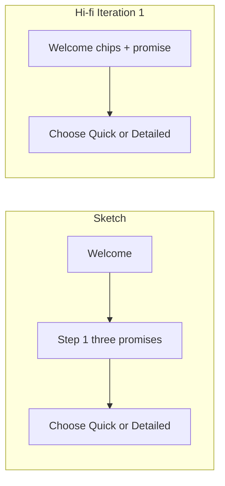

# WalkWell — Sketches → hi-fi: **what changed and why** (short brief)

Use this when you want readers to **get the point quickly**: same product intent, **clearer UI structure**, a few **real functional shifts**, and **honest** UX debt called out in one place—not a wall of tables.

**Related:** full journey flowcharts → `WalkWell-Iteration1-Flowcharts-README.md`.

**Assets:** hi-fi detailed strip + paper collage paths in your `assets\...image-2bf97ca1...png` and `...image-8c8f3fa2...png`.

---

## The one-paragraph story

The sketches already defined a **six-dimension comfort model** (safety, shade/heat, crowd feel, rest/physical, social/cultural, time trade-off) and a **profile you can edit without redoing the whole wizard**. The hi-fi **keeps that architecture** but **surfaces it more clearly**: a **labelled six-step stepper**, sharper **safety** copy (including **crossings** as a first-class choice), **richer shade options** (including “ignore shade”), a **longer possible time budget** (up to ~50 min), and **small copy/IA shifts** (e.g. “24/7 store” vs generic shopping). The **biggest deliberate UI difference** is **crowd**: sketches used a **slider** (quiet ↔ lively) to keep a **middle ground**; hi-fi uses **four radio levels**—simpler to tap, but **less continuous**. **Content and affordance nits** (wrong subtitle on one card, time “chips” that look like extra buttons) are **polish**, not the core Iteration 1 message unless your marker cares about evaluation.

---

## UI / functionality changes (scan-friendly)

| Area | Before (sketches) | After (hi-fi) | Why it helps (or what to watch) |
|------|-------------------|---------------|----------------------------------|
| **Wayfinding** | Step number + bar | **Named stepper** (Safety → Time) + icons | Users see **where they are** without reading the whole screen. |
| **Safety** | 3 toggles + crossings idea sometimes under “rest” | **4 toggles**; crossings **explicit** under safety | **Crossing quality** matches how you explain **night / “why this route”** later. |
| **Heat & shade** | 3 levels (low / balanced / max) | **4 choices** + **“no shade”** | Lets some users **turn shade off** (e.g. night-first mental model). |
| **Crowd** | **Slider** (spectrum) | **4 radio buckets** | **Pros:** fast, unambiguous. **Cons:** weaker **in-between** nuance than the sketch intent. |
| **Social / cultural** | Shopping + community + familiar + active streets | Similar set; **24/7 store** tilts toward **always-on amenity** (ties to **safety at night** narrative). | **Check** subtitle/copy QA on the frame (avoid wrong reused heading). |
| **Time trade-off** | **0–15 min** steps | **Slider to ~50 min** + minute marks | Matches **longer** “comfort vs speed” in route examples; **marks** can confuse users—fix in post-test polish. |
| **After setup** | **Profile list → tap row → Save back** (no full replay) | Same **pattern** in hi-fi | **Low rework** when people tweak one category. |

---

## Three figure callouts (if you show one slide)

1. **Stepper vs handwritten notes** — structure moved **into the UI**; research story moves **into your report text**.
2. **Crowd: slider vs radios** — same goal (**avoid empty and packed extremes**), **different control**.
3. **Time: short range vs long range** — wider trade-off; flag **chip affordance** only if discussing testing.

---

## Optional one-liner for captions

*“Hi-fi preserves the sketch comfort model but makes progress and choices more scannable; crowd input shifts from a spectrum to discrete buckets; time and safety choices are expanded to match real route trade-offs.”*

---

*Keep this file lean; put deep evidence (quotes, stats, full walkthrough) in the main report body.*

---

## Report playbook — **structure, selectivity, night/day, and “INITIAL” deliverables**

### Should you go screen-by-screen in that order?

**Yes, as *chapters*** (Initial → Detailed → Quick → Home/Search/Routes → Navigate → Post-trip), **but not as one pair for every control**. Markers want **argument + evidence**, not a catalogue.

| Do this | Avoid |
|--------|--------|
| **~1 composite figure per chapter** (sketch strip or key frame + hi-fi strip; **3–5 numbered callouts** max) | Dozens of side-by-side pairs (one per micro-control) |
| **One “pain → response” table per chapter** (about **4–6 rows**) | Repeating the same heuristic name under every bullet |
| **One small flow diagram** where the **sequence** actually changed (welcome / onboarding) | Full journey Mermaid in every section |

### Night vs day + “activity” instead of “crowd” — where it belongs

- **Say it once early** in **2–4 sentences**: after dark, hi-fi **re-labels and re-weights** explanations toward **lighting**, **street activity**, and **crossings**; **shade** and **crowd** stay in the **preference model** but are **not always the headline** when they explain less of the variance at night.
- **Revisit only** on **Route options**, **Route details / Why this route**, and **in-nav reroute** figures — the screens where labels actually change.
- **Wording:** use **activity** on **night** frames when you mean **enough people and open businesses for safety**; use **crowd** when the UI still says it or when you discuss **daytime** social/thermal comfort.

---

## **INITIAL** — exactly what to include (figures, tables, one diagram)

Use this as a **checklist** for the first chapter of your comparison.

### Figures (selective)

| ID | Composite | What it proves |
|----|-----------|----------------|
| **Figure A** | **Home / map** sketch → hi-fi | Defaults **legible**, **global IA**, **trust** (real map + components) |
| **Figure B** | **Welcome** sketch → hi-fi | **Value prop** before commitment, **CTA hierarchy**, craft |
| **Figure C** | **Onboarding** sketch (Step 1 value + Step 2 choose) → hi-fi **Choose setup** | **Removed redundant step**; **honest time badges**; clearer Detailed scope |

Optional **Figure C-alt**: narrow “three-panel flow evolution” only if layout allows.

### What to write under each figure (pattern)

1. **One sentence** — role of this screen in the journey.  
2. **Numbered UI changes** sketch → hi-fi; each point ends with **one short principle** in parentheses (e.g. *visibility of system status*, *recognition over recall*). **Cap at 6–9 bullets** per figure.  
3. **One closing sentence** — why this matters for WalkWell’s goals (comfort-aware walking, trust, low drop-off).

Your draft for Images A–C already matches this pattern; **trim** any repeated principles.

### Tables for INITIAL

**Table 1 — Sketch pain point → Hi-fi response** (single table covering A + B + C is fine).

| Sketch pain point | Hi-fi Iteration 1 response |
|-------------------|----------------------------|
| Opaque / placeholder defaults on Home | Named comfort tags + levels + “using defaults” line |
| Weak wayfinding beyond one hub | Persistent **Home / Saved / Preferences** |
| Abstract map / low production fidelity | Real map + consistent component styling |
| No explicit “what is the system doing?” | Defaults + personalise cue |
| Welcome: equal-weight CTAs | Primary **Set preferences** + secondary **Skip** |
| Weak feedforward (“what will I set?”) | Subtitle + **Safety / Shade / Simpler** chips |
| Redundant Step‑1 “three promises” after Welcome already signals them | Drop separate value screen; go to **Choose setup** |

**Table 2 — Deliberate IA decisions (optional, if rubric rewards rationale)**

| Decision | Sketch tendency | Hi-fi Iteration 1 | One-line rationale |
|----------|-----------------|-------------------|---------------------|
| Where value props live | Separate screen | Welcome (+ setup cards) | Fewer steps; same information earlier |
| Progress chrome | Bar tied to multi-step | Match real steps or simplify chrome | Avoid **false** completion cues |
| Quick path time claim | Sometimes overstated | **~30 s** style badge where honest | Reduces **expectation violation** |
| Naming | Inconsistent (Walkway / Walk Well) | **WalkWell** + logo | Consistent **identity** |

### One diagram for INITIAL (optional, small)

Use **only** if the assignment has room; **purpose** = show **sequence change** (sketch’s extra Step 1 removed in hi-fi).

**Caption:** *Hi-fi carries early value communication on Welcome, so a separate Step‑1 promise screen is redundant.*
### One-sentence “chapter takeaway” (INITIAL)

*Iteration 1 tightens **first-run trust** and **orientation**: readable defaults and nav on Home, stronger Welcome hierarchy, and **shorter onboarding** by removing a redundant benefits step once those promises appear earlier.*

### If word limit is brutal

- **Merge** Figures A + B into one row only if the marker allows density; otherwise keep **three figures** but **shorten** bullet lists to **4 per figure**.
- **Keep Table 1**; drop Table 2.
- **Drop** the Mermaid; keep **one prose sentence** describing the removed step.

---

## Later chapters — same *shape*, different *content*

Repeat per section: **one composite figure + 3–5 callouts + one 4–6 row pain → response table**. Add **night vs day** pairwise shots **only** for **route comparison**, **why this route**, and **reroute**. Full end-to-end flows stay in `WalkWell-Iteration1-Flowcharts-README.md`.
