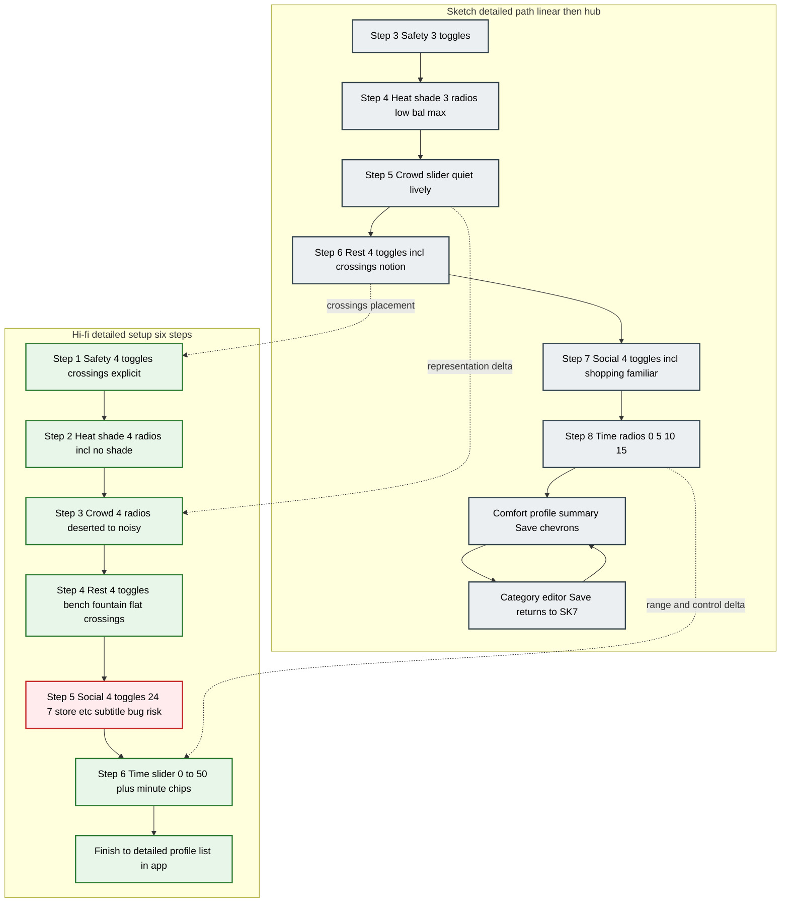

# WalkWell — Iteration 1: **Paper sketches vs current hi-fi** (functional comparison)

This document compares **what the hand-drawn flows specified** with **what the current detailed-setup (and related) screens implement**, in **feature-sized units**. It is written so you can lift tables into a report, match **numbered callouts** to figure exports, and paste **Mermaid** into GitHub or [mermaid.live](https://mermaid.live).

**Full-app journey diagrams (night vs post-study colours):** see `WalkWell-Iteration1-Flowcharts-README.md` in the same folder.

**Source materials in your workspace (for figures):**

- Hi-fi detailed setup strip: `C:\Users\asusn\.cursor\projects\c-Users-asusn-Documents\assets\c__Users_asusn_AppData_Roaming_Cursor_User_workspaceStorage_8233c5d5eab9afe657929928156f1fa1_images_image-2bf97ca1-b7b3-4321-b5c1-90f749347360.png`
- Paper sketches (annotated wizard + profile): `C:\Users\asusn\.cursor\projects\c-Users-asusn-Documents\assets\c__Users_asusn_AppData_Roaming_Cursor_User_workspaceStorage_8233c5d5eab9afe657929928156f1fa1_images_image-8c8f3fa2-77cb-483f-a7d9-1cf12196ae70.png`

**Legend for tables**

| Column | Meaning |
|--------|---------|
| **Sketch** | Hand-drawn corpus intent (steps 3–8 + profile + edit loop). |
| **Hi-fi now** | Current six-screen “Detailed setup” wizard in Figma-style export. |
| **Δ** | Net change for Iteration 1 reporting. |
| **Pain / rationale** | Why the change exists, or what problem it surfaces for usability writing. |

---

## 1. Start here — **Detailed setup** (feature-by-feature)

### 1.1 Shell & navigation (all six steps)

| Feature | Sketch | Hi-fi now | Δ | Pain point / rationale |
|--------|--------|-----------|---|-------------------------|
| **Wizard container** | Each step shows **step number** + **progress bar**; “Continue” linear. | Header **“Detailed setup”** + **horizontal stepper** with **six labels** (Safety → Time) and **icons**; active step highlighted. | **Stronger wayfinding** | Research annotations stressed **reducing cognitive load**; an explicit **labelled stepper** makes position in the task visible without reading body copy. |
| **Back** | Implied (standard mobile). | **Back arrow** top-left on each step. | **Same convention** | Supports **error recovery** (“I tapped wrong option”). |
| **Primary CTA** | “Continue” on intermediate steps. | “**Continue**” steps 1–5, “**Finish**” on step 6. | **Clear terminal action** | Matches expectation that the last step **commits** the wizard segment. |
| **Research traceability** | Handwritten notes tie **safety %**, **heat pain point**, **crowd spectrum**, etc. | Visual design only; **no on-screen rationale text**. | **Loss of *explicit* educative layer** | Sketches **encoded justification** for markers; hi-fi is cleaner but you must **explain rationale in the report**, not only in UI. |

---

### 1.2 Step A — **Safety / “What makes you feel safe?”**

| Control | Sketch | Hi-fi now | Δ | Pain point / rationale |
|--------|--------|-----------|---|-------------------------|
| **Avoid poor lighting** | Toggle ON concept (wording: low light / poorly lit). | Toggle; copy ties to **night lighting** (“good lighting at night”). | **Sharper night-safe wording** | Aligns safety construct with **after-dark legibility** — supports your **Iteration 1 night story** in the *preference model*, not only route screens. |
| **Avoid isolation** | Toggle ON. | Toggle ON; copy “quiet, low traffic places”. | **Same intent** | Matches sketch goal: skip **isolated** segments. |
| **People nearby** | Toggle ON. | Toggle ON; “busy footpaths / main streets”. | **Same intent** | Supports **natural surveillance** framing (later echoed in **night “activity”** route copy). |
| **Safer crossings** | **Not present** as own control (crossings bundled in “Rest & physical” in some sketch lists). | **Fourth toggle** — “signalised and zebra crossings”. | **Expanded surface area** | Makes **crosssing quality** a first-class preference; pairs with **night route “Why”** rows about **safer crossings**. Trade-off: **more toggles = slightly higher setup load** (mitigated by step grouping). |

**Sketch pain point called out in annotations:** safety theme **~29.3%** of concerns → screen **earned early placement** in the journey.

---

### 1.3 Step B — **Heat & shade**

| Control | Sketch | Hi-fi now | Δ | Pain point / rationale |
|--------|--------|-----------|---|-------------------------|
| **Construct** | Three ordered choices: **low / balanced / max** shade (efficiency vs shade). | **Four radios**: Fastest (minimal shade), Balanced (selected in mock), Maximise shade, **No shade** (ignore factor). | **Finer + explicit “ignore shade”** | Sketch avoided “null” shade; hi-fi adds **No shade** for users who **do not** want shade routing (e.g. night-primary users or simplicity). **Risk:** more options can slow **Quick**-minded users — stepper still contains it in one screen. |
| **Research link** | Annotation: **heat** top survey pain → need to **control sun exposure**. | Same user need; UI uses **plain language** under each radio. | **Preserved intent** | Report should cite **same pain point**; hi-fi removes the **handwritten %** but keeps the **behavioural offer**. |

---

### 1.4 Step C — **Crowd / social density along the route**

| Control | Sketch | Hi-fi now | Δ | Pain point / rationale |
|--------|--------|-----------|---|-------------------------|
| **Input pattern** | **Horizontal spectrum slider**: “Quiet streets” ↔ “Lively areas” — **one degree of freedom**. | **Four discrete radios**: Deserted → Quiet → Lively → Noisy. | **Representation changed** | Sketch rationale: users **dislike both** extreme crowding **and** emptiness → **slider** suggests **middle bias** and **low cognitive buckets**. Hi-fi **bins** the spectrum into **four labelled extremes** (including **“Deserted”**, which is stronger than “quiet”). |
| **Why this matters for your report** | Emphasise **faithfulness to research story** vs **engineering / design simplification**. | If the slider was **research-validated**, the radio version is a **deliberate or incidental departure** — state which. If deliberate: radios reduce **ambiguous slider thumb position**; if incidental: flag as **technical debt** or **post-study revisit**. |

---

### 1.5 Step D — **Rest & physical comfort**

| Control | Sketch | Hi-fi now | Δ | Pain point / rationale |
|--------|--------|-----------|---|-------------------------|
| **Bench rest points** | Toggle. | Toggle OFF in mock. | **Same control** | Sketch: routes **without** these features get **lower suitability** — hi-fi must **propagate** into scoring (implementation claim to check in prototype). |
| **Water fountain** | Toggle. | Toggle. | Same | |
| **Flat terrain** | Toggle. | Toggle. | Same | |
| **Safe pedestrian crossings** | In sketch list **here** (alongside rest). | In hi-fi moved to **Safety** step as **fourth toggle**; Rest step still has **“Safe pedestrian crossings”** toggle in your mock — **verify against Figma** (duplicate risk). | **Possible double placement** | If both exist, **harmonise copy** or **single source of truth** to avoid contradictory weights. If only one is true in final file, **update this table** to match repo-of-truth Figma. |

**Annotation pain from sketch:** “make walking **manageable**, not just possible” → **multiple simultaneous** comforts.

---

### 1.6 Step E — **Social & cultural comfort**

| Control | Sketch | Hi-fi now | Δ | Pain point / rationale |
|--------|--------|-----------|---|-------------------------|
| **Familiar neighbourhoods** | Toggle. | Toggle. Copy: “Increase scope of protection”. | **Same family** | Sketch linked to **identity-based risk** — keep that sentence in report ethics / cultural subsection. |
| **Religious / community** | “Religious/community centers”. | “Religious community centers” + gentler approach copy. | **Tighter wording** | Same intent; hi-fi more **respectful / careful** tone. |
| **Shopping areas** | Toggle (shopping). | **“24/7 store area”** toggle — **not identical** | **Semantic shift** | Sketch emphasises **daytime commercial vibrancy**; hi-fi emphasises **always-on amenity** (noise overlaps with **safety** at night). Good for **night comfort** story; may **drop pure retail** shade if that mattered in research. |
| **Active community streets** | Toggle. | Toggle ON in mock. | Same | |
| **Subtitle bug** | N/A | Card subtitle repeats **“Where you want to take rest?”** (wrong — copied from Rest step). | **Content QA failure** | Flag in **usability / polish**: erodes **trust** and **task clarity**; fix before submission if possible. |

---

### 1.7 Step F — **Time trade-off**

| Control | Sketch | Hi-fi now | Δ | Pain point / rationale |
|--------|--------|-----------|---|-------------------------|
| **Range** | **0 / +5 / +10 / +15 min** radios — coarse, **low screen height**. | **0–50 min** on a **slider** plus **six circular minute chips** (0–50). | **Wider range + dual control** | Users can aim for **longer willingness** than +15 (matches some hi-fi route cards). |
| **Affordance risk (post-study)** | Radios read as **one-of-many** clearly. | Chips **look like independent buttons** — participants may think **multi-select** or **navigate away**. | **Documented pain** | Belongs in **post–usability study**: **visual hierarchy** so **ticks ≠ primary actions**; you already colour-coded that work as **blue / polish** in the flow README. |

---

### 1.8 After the wizard — **Comfort profile summary & edit loop**

| Feature | Sketch | Hi-fi now (from broader app, align to your Figma) | Δ | Pain point / rationale |
|--------|--------|---------------------------------------------------|---|-------------------------|
| **Summary list** | **Six rows** (Safety, Shade, Crowd, **Physical**, Cultural, **Time**) with **chevron** edit. | Detailed profile list in app matches same **categories** (wording may vary: “Physical comfort”). | **Non-linear return** | Sketch explicitly: **Save returns to profile**, not forced linear replay — **reduces rework** after testing. |
| **Edit from summary** | Category screen with **Save** replaces **Continue**. | Same pattern in hi-fi profile editors (**Save**). | **Preserved** | Critical for **iterative tuning** without re-onboarding. |
| **Customise more** | Quick path can **expand** to detailed (in other sheets). | Present in quick-profile flows in hi-fi. | **Outside this strip** | Mention **cross-link** if figure set is detailed-only. |

---

## 2. **Annotated figure guides** (what to put on exports)

### Figure D1 — **Side-by-side: paper Step 3–8 vs hi-fi six steps**

**Layout:** Left = sketch collage; Right = six-phone strip (your first image).

| Callout | Point on **sketch** | Point on **hi-fi** | One-line caption for marker |
|--------|---------------------|---------------------|------------------------------|
| **①** | Handwritten **% / “top pain point”** notes next to Safety / Heat. | **Stepper labels** + icon row. | “Research rationale lived in **annotations**; hi-fi carries **structure + clarity** on-device.” |
| **②** | **Crowd = slider** between quiet ↔ lively. | **Crowd = four radio cards**. | “**Same preference dimension**, **different control** — impacts granularity and middle-ground bias.” |
| **③** | Time = **+15 min cap** radios. | Time = **50 min slider + chips**. | “**Wider time budget** exposure; **affordance risk** on chip styling (post-test).” |
| **④** | Profile **Save** + **chevron** edit loop. | (Separate frame) detailed profile — align when compositing. | “**Non-linear editing** preserved after wizard.” |
| **⑤** | Crossings may sit under **Rest** in sketch. | Crossings emphasised under **Safety** (and check Rest duplicate). | “**Information architecture** refined; watch **duplicate controls**.” |

Keep to **five** bullets in caption; move extra nuance to body text.

### Figure D2 — **Single hi-fi step with critique callouts (for pain-focused paragraph)**

Use **Social & Cultural** + **Time** screens:

| Callout | Location | For report |
|--------|----------|------------|
| **①** | Social card **wrong subtitle** | Content bug → **credibility** risk. |
| **②** | Rest step **generic body text** repeated | Placeholder → says “**Rest stops will be added**” for all toggles → weak **specificity**. |
| **③** | Time **circular minute chips** | **False affordance** risk (post–usability study). |

---

## 3. Flowcharts — **Detailed setup only** (Mermaid, colour-coded)

**Class meanings**

| class | Meaning |
|--------|---------|
| `sketch` | Behaviour / control as **paper** specified. |
| `hifi` | **Current** detailed wizard behaviour. |
| `issue` | **Mismatch**, **bug**, or **usability debt** to mention in report. |

**GitHub note:** If red styling on `H5` does not render, mention “subtitle QA” in prose only; or duplicate a small `issue` node linked to `H5`.

---

## 4. **Synthesis paragraph** (paste into Iteration 1 section)

*The detailed-setup sketches grounded each comfort dimension in **survey-derived pain points**—for example foregrounding **safety early**, treating **heat and shade** as a primary lever, and modelling **crowd comfort as a continuous spectrum** to avoid both **over-empty** and **over-crowded** routes. The current hi-fi preserves the **six-dimension architecture** and strengthens **orientation** through a **labelled six-step stepper**, **explicit safer crossings** in safety, and a **broader time trade-off** (up to **50 minutes**) aligned with later route cards. The largest **functional drift** is **crowd input**: **slider → discrete radio bins**, which changes how **middle preferences** are expressed; the team should justify this as either **reduced ambiguity** or **reopen** the slider if fidelity to the research rationale is required. **Content-quality** issues visible in the mock (**duplicated Rest subtitle** on Social, **generic Rest descriptions**) and **minute-chip affordances** belong in **evaluation-driven polish** rather than the core Iteration 1 **night-context** story unless your rubric bundles them.*

---

## 5. Next sections (same document pattern — extend when ready)

Use **the same table skeleton** for:

- **Quick setup** (two-step + quick profile vs sketch quick path),
- **Welcome / Choose setup**,
- **Home → search → routes → why → nav** (tie to night framing elsewhere),
- **Post-trip feedback / alter prefs**.

The **flowchart + Mermaid** file `WalkWell-Iteration1-Flowcharts-README.md` remains the place for **full-journey** diagrams; this file is the **functional diff** lens starting at **detailed setup**, as requested.

---

*End. Align any “duplicate crossing toggle” row with your canonical Figma before submitting — treat this table as **comparison logic**, not a guarantee every duplicate exists in latest export.*
